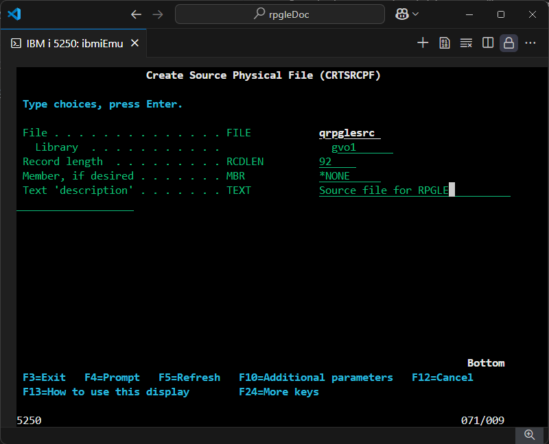
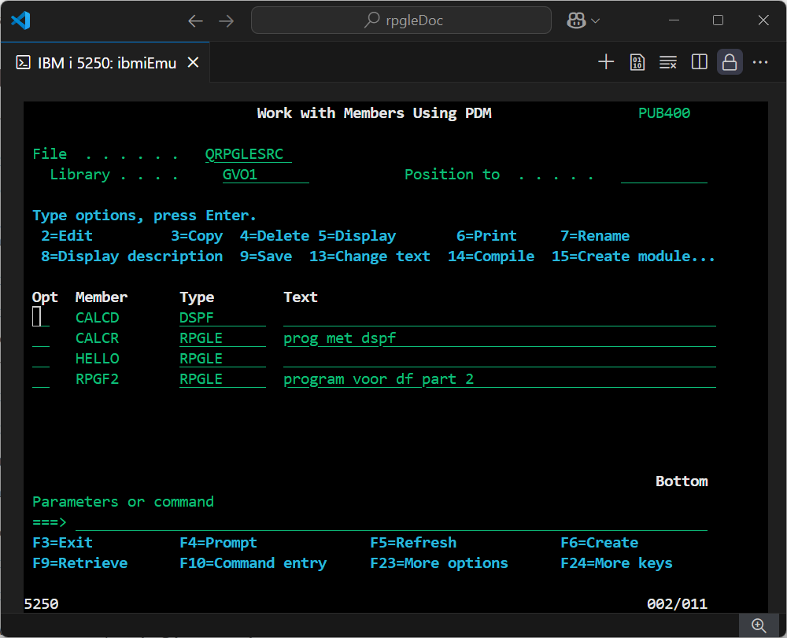
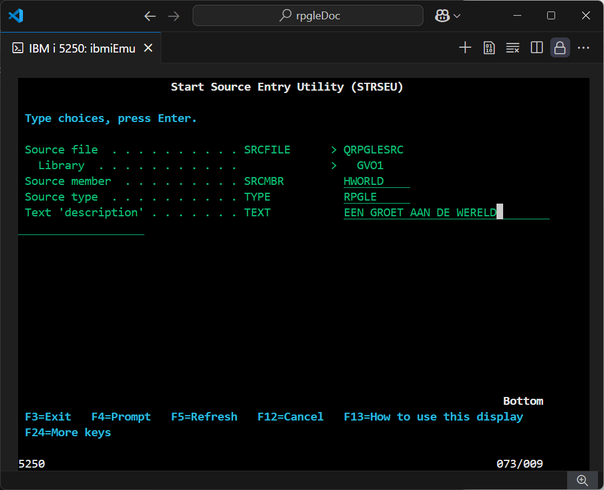
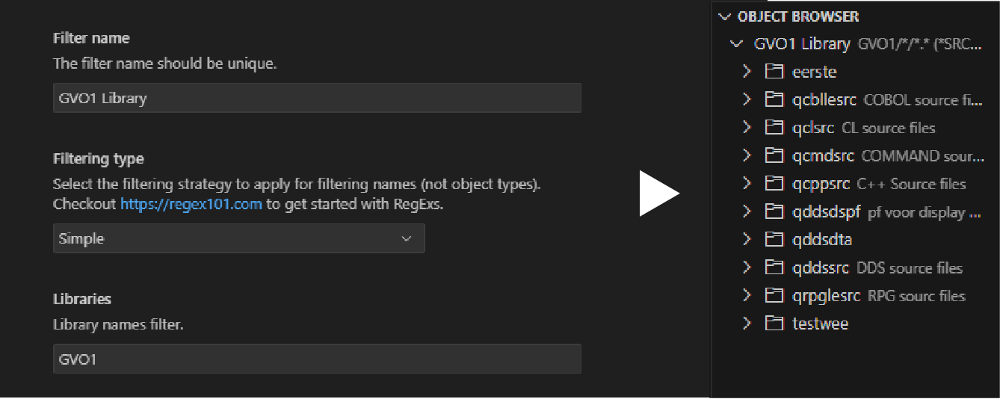
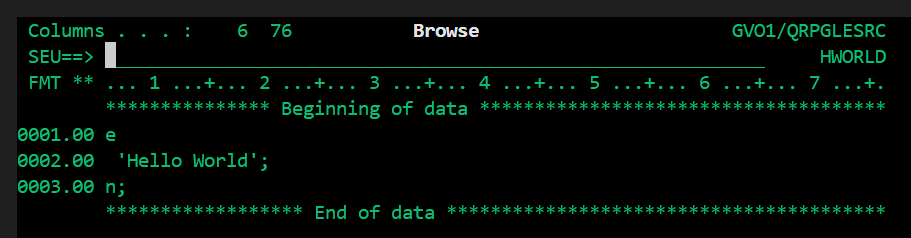
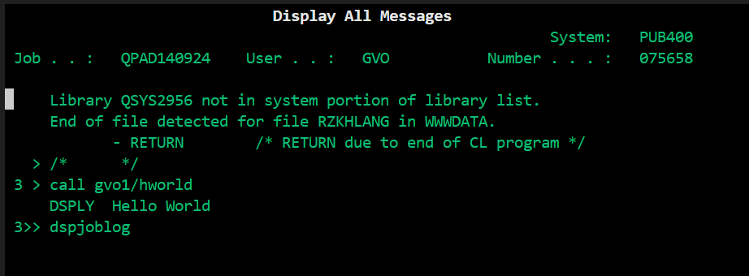

# 1.2 Hello World

*Hier wordt ervan uitgegaan dat je de terminal werkend hebt gekregen en opgestart via Visual Studio Code.*

## Structuur

De bestanden zijn alsvolgt opgebouwd in je IBM i systeem:
- Library
  - Object
    - Member
    - Member
    - Member
  - Object
    - Member
    - Member

Je zal de hele tijd maar in één library werken. De source files die je maakt zijn allemaal objecten, en je code-bestanden zijn members.

Je hebt verschillende member types, dit zegt wat voor soort bestand het is, bijvoorbeeld .RPGLE als je een stuk RPGLE code wilt schrijven. Elke member type zet je het liefst in een aparte object/source file.

### Library aanmaken
Om te beginnen met coderen heb je eerst een library en source file nodig. Dit doe je allemaal in de terminal die je start via Visual Studio.

Met de command `CRTLIB` maak je een nieuwe library aan. Geef het een korte maar herkenbare naam. Ik gebruik mijn intialen bijvoorbeeld.

Library Type kun je op *PROD houden. Bij Text Description kun je een korte beschrijving zetten. 

### Source file aanmaken

Als je eenmaal een library hebt, maak je een source file aan met de command `CRTSRCPF`. Noem het `QRPGLESRC`, check of de library klopt. De text description kun je ook overnemen ter verduidelijking voor jezelf.



### Member aanmaken
De volgende stap is om een 'member' aan te maken binnen de source file. Je wilt op het scherm komen waar bovenin staat: 'Work with Members using PDM'. Het kan zijn dat je hier automatisch op komt wanneer je net je source file hebt aangemaakt. Maar zo niet, ga dan helemaal terug naar het startscherm door een paar keer op F3 te klikken, en typ in de command line: `WRKMBRPDM`.



Check of linksboven bij achter file `QRPGLESRC` staat. Zo niet, typ dat dan in en druk op enter. Nu zit je in de source file.

Wat we nu willen is een nieuwe member aanmaken om in te kunnen coderen. Onderaan het scherm zie je alle functie keys, hier zie je al 'F6=Create' staan. Dus druk op F6 om een nieuwe member aan te maken binnen deze source file.



Naast Source Member kun je je bestand een naam geven, bij Source Type zeg je RPGLE (we willen immers in die taal de code schrijven), en bij description kun je optioneel een beschrijving toevoegen.

Wanneer je op enter drukt kom je in de SEU. Hier kun je je code in schrijven. Maar dit willen we niet, deze ingebouwde text-editor is namelijk standaard in de oude 'column based' format en is niet bepaald gebruikersvriendelijk laat staan voor beginners.

## Werken in Visual Studio

Wij willen in de moderne free format schrijven in Visual Studio die automatisch je code controleert.

In Visual Studio Code navigeer naar je IBM i omgeving. Aan de linkerkant vindt je dan als het goed is de User Library List, Object Browser en IFS Browser.

Bij je Object Browser, druk op het trechter icoontje om een nieuwe filter te maken. Geef het elke naam dat je wilt, en onder Libraries zet de naam van je library die je eerder hebt gemaakt. De andere instellingen kun je met rust laten.



Wanneer je op Save Settings drukt zie je al je source files. Bij het aanmaken van je library zijn er automatisch allemaal source files aangemaakt, die krijg je nu ook te zien, inclusief de QRPGLESRC die je eerder zelf hebt gemaakt.

Klap de QRPGLESRC folder uit en open het hworld.rpgle bestand. Nu zit je in een leeg tekstbestand.

### Code

We moeten zelf aangeven in de free format te willen coderen, dit zeg je door bovenaan **free te zetten. Hopelijk spreekt de rest van de code voor zichzelf. Vergeet niet op te slaan met Ctrl+S.

````
**free
dsply 'Hello World';
return;
````

## Compileren

Om je programma te kunnen aanroepen (callen), zullen we het eerst moeten compileren. Dit kan op twee manieren, via de IBM i terminal, en via Visual Studio. 

Visual Studio is het makkelijkst, maar het is ook belangrijk om bekend te raken met de IBM i terminal. Dat is waar alles namelijk gebeurt, ik leg beide manieren dus uit.

### Via de terminal

- Op het startscherm, typ in het commando `WRKOBJPDM`. Check bovenin of je in de juiste library zit, eventueel kan je ook je library name achter de command zetten. Mijn library heet GVO1 dus dan wordt mijn command `WRKOBJPDM GVO1`.
  
- Dit scherm ben je bij het aanmaken van je source file ook al tegengekomen. Dit is een lijst met alle objecten binnen je library. Zoek naar QRPGLESRC, je kan scrollen met page up/down.

- Voor QRPGLESRC, typ '12' en daarna op enter. Hiermee open je als het ware het object.

- Nu zit je in de member list van het object. Je vindt hier ook je 'HWORLD' RPGLE bestand. Je kan checken of de code correct is opgeslagen door optie 5 in te voeren. Typ dus voor het programma '5' en dan op enter.



- Bovenstaande krijg je dan te zien. Het valt je misschien op dat de eerste 5 karakters van elke regel niet zichtbaar zijn, dit komt doordat deze achter de regelnummers (0001.00) zitten verstopt. Dit is echter geen probleem, de computer kan wel gewoon lezen wat daar staat. Als alles voor de rest klopt druk je op F12 om een pagina terug te gaan.

- Nu typ je voor HWORLD '14' en enter om te compileren. Als je op een bevestigingsscherm komt, zet 'Delete existing object' naar 'Y' en druk nogmaals op enter.

- Onderaan je scherm krijg je te zien 'Program HWORLD placed in library'. Mocht je een error krijgen dan is er iets fout met je code.


### Via Visual Studio Code

Het compileren via Visual Studio gaat gelukkig een stuk makkelijker en sneller:

- Wanneer je in je code bestand zit in Visual Studio, druk je op Ctrl+E, en kies dan 'Create Bound Program (CRTBNDRPG)'. Als je je terminal open hebt staan in VS Code zie je daar de compilatie gegevens. Eventuele foutmeldingen worden hier ook getoond.


## Programma oproepen

Als het compileren is geslaagd kun je het nu oproepen in de terminal. 

Ga naar het startscherm van je terminal en typ in: call `LIBRARY/HWORLD`. In mijn geval typ ik dus `GVO1/HWORLD`. Druk dan op enter.

Misschien dat je niets ziet, of maar heel kort. Om onze boodschap toch nog terug te zien kun je de command `DSPJOBLOG` gebruiken. Druk dan F10 in om gedetailleerde berichten te bekijken, en dan F5 om te refreshen. Dit krijg je dan als het goed is te zien:



DSPJOBLOG kun je later ook goed gebruiken om te troubleshooten. Later kun je ook zelf schermen maken en die beïnvloeden aan de hand van code.

## Handige linkjes

Als bepaalde onderdelen niet lukken of werken, wordt hier ook  min of meer hetzelfde uitgelegd:

1. [AS400i - Create Library and Source Physical Files](https://as400i.com/2013/03/11/create-library-and-source-physical-files/)
2. [IBM -  RPGIV beginner's tutorial](https://www.ibm.com/support/pages/coding-rpg-iv-beginners-tutorial)