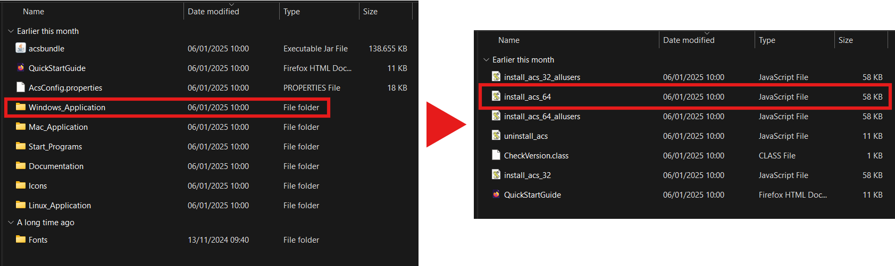

# 1.1 Installatie

De meest moderne manier om het IBM i systeem te gebruiken en in RPGLE te coderen is met Visual Studio Code. Dus dat is waar we mee gaan werken. Daarvoor moeten er eerst het een en ander geinstalleerd en geconfigureerd worden.

### PUB 400
Om toegang te krijgen tot een publieke testserver, ga je naar [pub400.com](https://pub400.com). Dit zorgt ervoor dat je vanaf je eigen PC toegang krijgt tot een openbaar IBM i systeem. Maak een account aan en volg de instructies. Mijn Gmail ontving geen verificiatiemail, andere mailservices werken waarschijnlijk wel gewoon.

### IBM i Access
Wanneer je je pub400 account hebt, download je dit programma om eenmalig je pub400 account te configureren.

Ga naar deze [pagina](https://www.ibm.com/support/pages/ibm-i-access-client-solutions) en volg de 'Downloads for IBM i Access Client Solutions' link. Hier moet je een IBM account aanmaken waarna je als het goed is terecht komt op de download pagina. Kies het bovenste bestand genaamd 'IBM i Access Client Solutions', op moment van schrijven is de nieuwste versie 1.1.9.7.

Eenmaal in de folder, moet je de applicatie nog installeren. Ik gebruik Windows, dus ga naar de Windows_Application folder.

Als je niks ziet gebeuren bij dubbelklik op de install_acs bestand, kan het zijn dat je [Java](https://www.java.com/nl/download/) nog moet downloaden.

Eenmaal gedownload kun je nu vanuit de IBMiAccess_v1r1 folder de 'acsbundle' starten. Als het goed is kom je dan op dit scherm:

Klik in de lijst op de '5250 Session Manager' dat is geselecteerd in de afbeelding. Dan kom je op een scherm met allemaal instellingen, in principe hoef je alleen nog de 'Destination Address' in te stellen op 'pub400.com'.

Klik op 'OK' en dan krijg je een inlogscherm te zien. Voer je PUB400 username in en de wachtwoord die je hebt gekregen via je mail. Als dat lukt krijg je de 5250 terminal scherm te zien. Log hier opnieuw in met dezelfde username en wachtwoord. Bij je eerste inlog wordt je gevraagd je wachtwoord te resetten. (tip, bedenk geen al-te-lange wachtwoord. Ook is het niet hoofdlettergevoelig)

### Visual Studio

Nu je succesvol je account hebt aangemaakt en hebt gekoppeld met de PUB400 publieke server, kun je het gebruiken in Visual Studio. Deze extensie in Visual Studio Code zul je moeten downloaden om de terminal makkelijk te kunnen gebruiken.

Ik raad de [Quick Start](https://codefori.github.io/docs/quickstart/) handleiding aan van deze extensie om je op weg te helpen. Deze connection instellingen gebruik je om te verbinden met het PUB400 systeem. De username en password vul je zelf uiteraard in.
