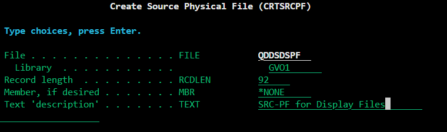
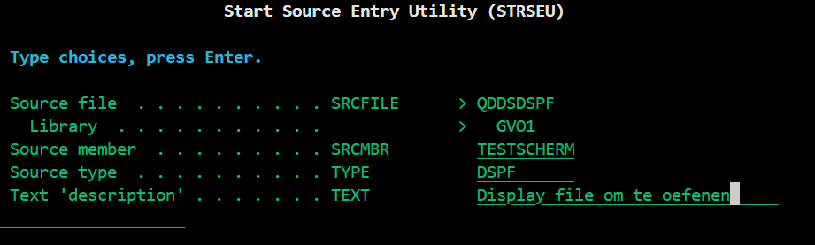
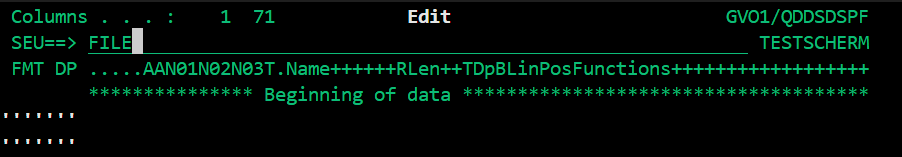
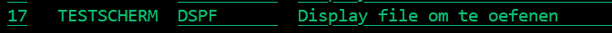
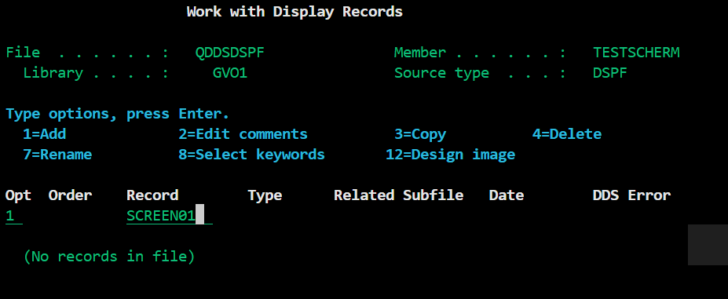
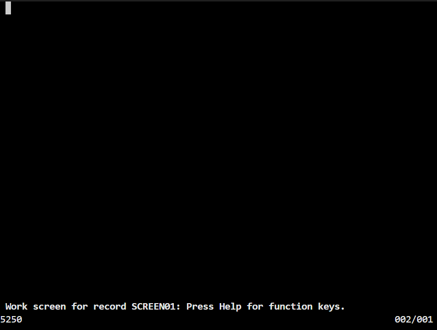

# 2.2 Display File Aanmaken

*Mochten bepaalde stappen niet lukken, [deze tutorial](https://medium.com/@gkarchana1/display-file-in-rpgle-part1-4937c3a54710) legt hetzelfde uit.*

### Maak Source Physical File

Display files zijn een andere member-type (bestandstype) dan RPGLE bestanden. Dus om alles geordend te houden maken we eerst een andere source physical file aan waar we alle display files in bewaren. De source physical file wordt een object binnen onze library.

1. Gebruik de command `CRTSRCPF`.
   
2. Noem het bestand 'QDDSDSPF'

3. Zet je eigen library-name achter library

4. Geef het een simpele beschrijving waarvoor je source physical file bestemd is.

### Maak Display File

Na het creëeren van je source physical file kom je als het goed is op de 'Work with Members Using PDM' scherm van je QDDSDSPF (zie wit-gekleurde titel bovenin). Zo niet, ga dan terug naar het startscherm en gebruik de command `WRKMBRPDM LIBNAME/QDDSDSPF` (Vul jouw eigen library name in op de plaats van LIBNAME).

Eenmaal op dit scherm, druk je op F6 om een nieuwe member aan te maken.

1. Achter Source member zet je de naam. Dit kan maximaal 10 karakters zijn.
   
2. Achter Source type zet je het bestandstype. Dit wordt in dit geval 'DSPF'.DSPF
   
3. Bij text description kun je kort uitleggen wat je display file laat zien.
   
4. Druk op Enter, nu is je display file aangemaakt.

### Naar Screen Design Aid

De Screen Design Aid is de meest gebruiksvriendelijke manier om je scherm te ontwerpen. Om hier te komen moeten we eerst wat stoppen volgen:

1. Na het aanmaken van je display file kom je terecht op de 'Edit' pagina.
   
2. Typ linksboven achter SEU==> 'FILE' en dan op enter om het lege bestand op te slaan.

3. Nu ben je weer terug in je 'Work with Members Using PDM' scherm.

4. Er is een optie die je toegang geeft tot de SDA (Screen Design Aid). Als je die niet kan vinden druk je op F23 (Shift + F11) om meer opties in te zien. Als het goed is vindt je dan achter optie 17 'Change using SDA' staan.
   
5. typ in '17' voor je 'TESTSCHERM' member en dan op enter.

6. Nu zit je in het 'Work with Display Records' scherm. Je display file kan uit meerdere **records** bestaan:
   - Bijvoorbeeld wanneer je programma meerdere schermen nodig heeft. Je begint met een startscherm, dan ga je naar een keuzemenu om vervolgens bijvoorbeeld een planning in te zien.
  
   - Wat je ook met records kan doen, is een scherm verdelen in meerdere records. Zo kun je bijvoorbeeld een aparte header, body en footer maken en die samenvoegen tot één pagina. Voordeel hiervan is dat je je header en/of footer dan maar een keer hoeft te ontwerpen, en daarna kun je die makkelijk in je andere schermen hergebruiken.

7. Voor nu hebben we genoeg aan één record. Typ onder Opt '1', en onder Record 'SCREEN01', dat wordt de naam van het scherm dat we gaan ontwerpen. Druk dan op enter.

8. Dan kom je op een bevestigingsscherm. Daar zie je naast New record 'SCREEN01' staan, en naast Type 'RECORD'. Druk nog een keer op enter.

9. Je ziet nu een zwart scherm en je kan met de pijltjes je cursor verplaatsen. Je bent nu klaar om te starten met het ontwerpen!

