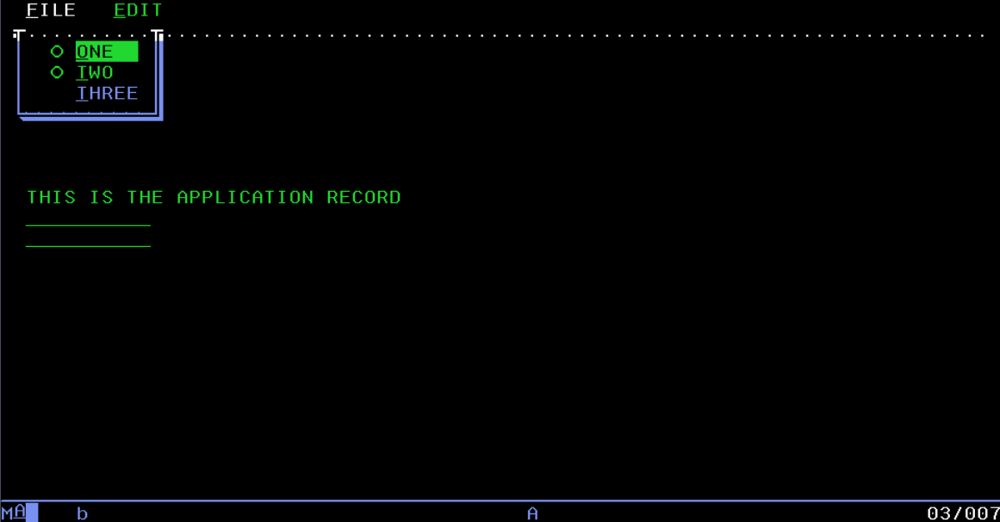
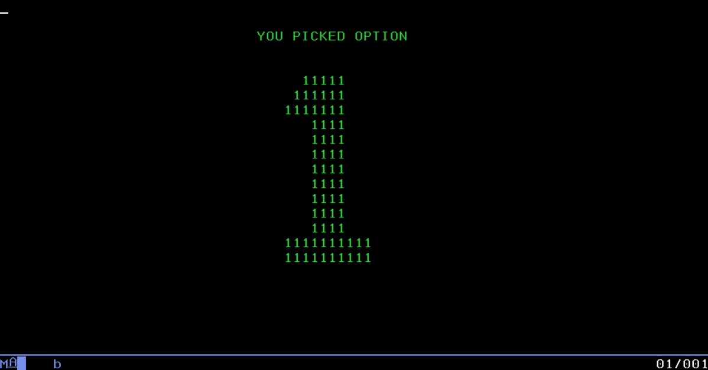

# 2.1 Introductie Display Files

### Waarom Gebruiken?

Het gebruik van de display files zit in het IBM i systeem gebouwd. Het is de meest simpele en voor de hand liggende manier om je programma's een interface te geven. Later kun je ook je programma's een interface geven met behulp van JavaScript frameworks zoals React. Maar voor nu is het belangrijk om de basis te leren met Display Files.

Display files maak je helemaal binnen de terminal, je gebruikt Visual Studio pas wanneer je back-end code maakt voor je display file.

### Wat kun je ermee?

In principe is elk scherm dat je in de terminal ziet een display file. Echter betekent dat uiteraard dat je best gelimiteerd bent aan mogelijkheden, je kan je cursor ook niet gebruiken.

Maar de belangrijkste functies zitten er wel ingebouwd. Je kan navigeren tussen schermen, keuzemenu gebruiken, data invoegen en tabellen m.b.v. een database opzetten.

