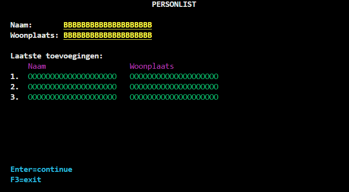

# 2.4 Koppelen met RPGLE

Een mooi basisprogramma om mee te beginnen is een simpele rekenmachine.

## Opzet Display File

Maak in je QDDSDSPF source physical file een nieuwe display file aan genaamd PERSONLIST. Zie ['Maak Display File'](DF_aanmaken.md#maak-display-file).

Probeer aan de hand van het vorige hoofdstuk dit onderstaand scherm na te maken.

- De 'Both' velden hebben de namen NAMEIN en CITYIN.
- De Output velden in de lijst hebben de namen NAME01, CITY01, NAME02, CITY02, NAME03, CITY03.



Sla dit scherm op door op F3 te drukken.

### Keyword toevoegen

We willen een manier hebben om uit het programma te gaan. De ongeschreven regel is dat dit in IBM i programma's altijd gebeurt met F3. Het gebruik van de F3 toets moeten we handmatig in de record zetten.

In het 'Work with Display Records' scherm, typ 8 bij de opties voor het scherm dat we gebruiken.


Achter 'Indicator keywords' typ je nu 'Y'. Vul dan deze velden in, de CF03 staat voor de F3 toets.


Vervolgens druk je 2x op enter om terug te gaan naar je Display Records.

**Sla vervolgens je display file op en compileer het.** Nu kunnen we aan de slag met de code.

## RPGLE Code

Allereerst hebben we een nieuw RPGLE bestand nodig. Navigeer naar je QRPGLESRC Physical File Source Object. Eventueel kun je de command `WRKMBRPDM LIBRARY/QRPGLESRC` gebruiken.

Druk op F6 om een nieuw bestand aan te maken en noem het 'PL_CODE' met de source type 'RPGLE'. Text description is optioneel.

### Te werk in Visual Studio

Na het succesvol aanmaken, navigeer je nu naar Visual Studio. Als het goed is heb je in je object browser al je library staan. (zo niet, volg dan [deze stappen](../start/HelloWorld#bestanden-terugvinden-in-visual-studio)).

Vindt in je QRPGLESRC folder je net-aangemaakte bestand 'PL_CODE'. Het kan zijn dat je de object browser moet refreshen door op de het '⭮' symbooltje te klikken. Deze verschijnt wanneer je de cursor over de Object Browser header houdt.

### Uitleg code

Open het lege RPGLE bestand om daar in te gaan coderen.

1. Als eerst moeten we meegeven dat we in **free-form** willen coderen. Op de eerste regel zet je `**free`
2. Vervolgens moeten we **declareren welk extern bestand** we willen koppelen met onze RPGLE code. Dit doen we met `dcl-f PERSONLIST workstn; `. PERSONLIST is de naam van onze gecompileerde display file, en met workstn zeggen we dat PERSONLIST een display file is. Nu kan de RPGLE code de display file aflezen.
3. Ook wordt er gecheckt of beide velden zijn ingevuld met een simpele if-statement.

Hieronder de complete code, probeer zelf eens te begrijpen wat hier staat:

```
**free
dcl-f PERSONLIST workstn;

dcl-ds ScreenData;
    nameIn  char(20);
    cityIn  char(20);
    name01   char(20);
    city01   char(20);
    name02   char(20);
    city02   char(20);
    name03   char(20);
    city03   char(20);
end-ds;

dcl-s exitProgram ind;  // Indicator voor afsluiten
dcl-s invalidInput ind; // Indicator voor foute invoer

dow not exitProgram;

    invalidInput = *off;

    exfmt SCREEN01;

    if *in03 = *on;  // Controleer of F3 is ingedrukt
        exitProgram = *on;
        leave;
    endif;

    // Controleer of beide velden zijn ingevuld
    if nameIn = *blanks or cityIn = *blanks;
        dsply 'Fout: Beide velden moeten worden ingevuld!';
        invalidInput = *on;
    endif;

    if not invalidInput;
        // Adressen opschuiven in de lijst
        name03 = name02;
        city03 = city02;
        name02 = name01;
        city02 = city01;
        name01 = nameIn;
        city01 = cityIn;

        // Naam en woonplaats velden leegmaken voor volgende invoer
        // (bij gebruik van een input field hoeft dit niet. maar wij gebruiken 'both' fields)
        nameIn = *blanks;
        cityIn = *blanks;
    endif;
enddo;

*inlr = *on;
return;
```

Als je deze code hebt, sla je het op en compileer het via [visual studio](../start/HelloWorld#via-visual-studio-code) of de [terminal](../start/HelloWorld#via-de-terminal).

Als je geen foutmeldingen krijgt, kun je het programma nu oproepen met de command `CALL LIBRARY/PL_CODE`.

Dan wordt onderstaand scherm getoond. Je kan de naam en woonplaats invoeren, en bij enter wordt het bovenaan de lijst gezet. Als je meer dan 3x wat invult zal de oudste invoer verdwijnen van de lijst. Check ook of de foutmelding het doet wanneer je 1 of 2 velden leeg laat bij enter.

F3 om het programma af te sluiten zou het ook moeten doen.


### Vervolg

Waar je misschien zelf al achter bent gekomen is dat de ingevulde data nergens wordt opgeslagen. Als je het programma opnieuw oproept is de lijst weer leeg. Dat kunnen we oplossen door een physical file te maken en koppelen.

Bewaar dit project want hier gaan we nog mee verder.