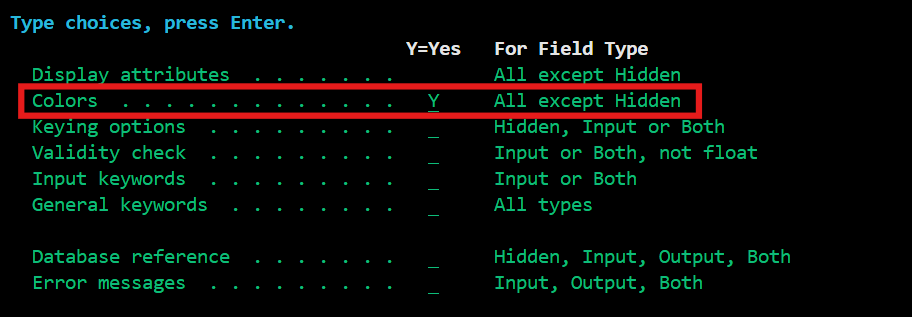

# 2.3 Display Files Ontwerpen

*Tip: gebruik de naviatie aan de rechterzijde om makkelijk tussen onderdelen te springen*

## Basisregels in de Screen Design Aid
- Je navigeert over het scherm met de pijltjes op je toetsenbord.
- De toevoegingen die je maakt worden pas definitief als je op enter drukt.

## Tekst toevoegen
Om tekst op het scherm toe te voegen, typ je je woorden en/of hele zinnen tussen enkele aanhalingstekens.

Bij druk op de entertoets verdwijnen de aanhalingstekens:

Dit is statische tekst. Je kan dit niet via je RPGLE code aanpassen, het is geen variabele.

## Datum & tijd

Dit voeg je simpelweg toe door `*date` en `*time` te typen, en daarna op enter. Dit is een variabele dat de huidige datum en tijd pakt op het moment dat je programma opstart.

## Input- en outputvelden

### Input
Als je de gebruiker tekst wilt laten invoeren, typ je bijvoorbeeld `+i(20)`
Hier betekent +i dat je een inputveld op deze locatie wilt toevoegen, en met (20) zeg je dat het veld uit maar maximaal 20 karakters kan bestaan.

### Output
Je kan ook output tonen. Zo kun je aan de hand van gebruikersacties feedback tonen. Dit werkt bijna hetzelfde als de input, namelijk `+o(20)`

Als je nu op enter drukt, krijg je:

### Both
Je kan een veld ook zowel een input als output maken. In de praktijk zou je dit kunnen gebruiken om bijvoorbeeld je zoekopdracht in het veld te laten staan wanneer je op enter drukt. Als namelijk bij een inputveld op enter drukt, wordt het veld weer helemaal leeggemaakt. Of wanneer je door pagina's wilt navigeren door een paginanummer in te voeren, dan is het wel fijn dat je na enter nog kan zien op welke pagina je bevindt.

Dit schrijf je als `+b(2)`

### Naamgeving
De input/output velden wil je uiteraard in je RPGLE code gebruiken. Om dat te doen kan je de namen van elk inputveld aanpassen. Dit doe je door vóór een veld een vraagteken te zetten.

Druk dan op enter. Linksonder verschijnt nu een tekstveld met een automatisch gegenereerde naam. Verander dit met je eigen naam (max 10 karakters).

Druk dan op enter, nu heeft dit inputveld de naam INHUISDIER die je kan gebruiken in de RPGLE code.

Dit werkt hetzelfde als bij de 'output' en 'both' veld. Wel aan te raden om in je naamgeving te zeggen wat voor veld het is, dus begin met bijvoorbeeld in/out/both.

## Tekst aanpassen

Het is ook mogelijk om tekst en velden te verplaatsen, verwijderen en op te maken.

### Verplaatsen

#### Opzij verplaatsen

Dit doe je door pijltjes links of rechts van je tekst te zetten. Elk pijltje is 1 kolom opzij.

Na enter:

#### Tussen regels verplaatsen

Dit doe je door je tekst tussen '-' streepjes te zetten. En waar je vervolgens de '=' teken plaatst wordt de nieuwe locatie.

Na enter:

#### Centreren

Om tekst te centreren op je scherm, plaats je simpelweg de 'a' vóór de tekst, en 'c' over de eerste letter van de tekst. `verplaats deze tekst` wordt dan `acerplaats deze tekst`. Druk dan op enter.

### Verwijderen

Om tekst te verwijderen, zet je een 'd' voor de tekst dat je wilt verwijderen. Bij druk op de enter zal het weggehaald worden.

### Kleuren

Je kan tekst en velden ook kleuren geven zodat het gebruiksvriendelijker wordt. Zo kun je bijvoorbeeld alle verschillende soorten velden een aparte kleur geven.

Om dit te doen, typ '*' voor de tekst dat je wilt aanpassen en dan op enter.

Hier vindt je nog allemaal andere instellingen die later van nut kunnen zijn, maar voor nu wil je Colors selecteren door daar 'Y' te typen.

Nu kun je kiezen uit 7 verschillende kleuren. Typ '1' achter de kleur die je wilt, en dan op enter en nog een keer op enter zodat je weer terug bent op je scherm.

Zo kun je je scherm er dan uit laten zien:

## Opslaan en compileren

Als je scherm helemaal af is, druk je nu op F3, en dan kies je de eerste optie (Save work since last Enter).

Nu zit je op het 'Work with Display Records' scherm. Druk op F12 om een pagina terug te gaan.

*Mocht je nu op de 'Save DDS - Create Display File' scherm komen, druk je nogmaals op enter, en bij het scherm van Display Messages nog een keer op enter, en daarna nóg een keer op enter. Nu kom je als het goed is op de 'Work with Members using PDM' scherm.*

Als je op de 'Work with Members Using PDM' scherm zit, typ je bij je display file '14' en dan op enter om te compileren. 

*Misschien dat je wordt gevraagd om een al-bestaand bestand met dezelfde naam te overriden. Maak daar dan 'Y' van en druk nogmaals op enter.*

Als het goed is krijg je onderaan dan een bevestigingsbericht te zien dat het is gelukt.

### Compileren met foutmelding

Het kan af en toe zijn dat het compileren niet lukt met een foutmelding over je GENLVL. Deze 'severity level' wordt gebruikt om te meten hoe erg je fout is.

Severity level:

- 00: Geen fouten, compileren geslaagd.
- 10: Er is een minimale fout gevonden, maar is geen problemen voor het programma.
- 20: Fout gevonden, maar het programma zou alsnog kunnen werken
- 30: Grote fout gevonden, kleine kans dat het programma werkt zoals je wilt

Standaard zal het compileren slagen bij GENLVL 20. Als je een error met level 30 krijgt zal het dus niet lukken. Om dit te omzijlen kun je het volgende doen:

1. Typ 14 voor de display file dat je wilt compileren. (niet op enter!)
2. Druk vervolgens op F4 om het prompt-scherm te openen.
3. Verander de Generation severity level (GENLVL) naar 30.
4. Druk op enter

Op deze manier kun je je display file compileren ook al is het niet helemaal perfect. Echter kan het toch zomaar zijn dat het scherm doet wat je wilt.