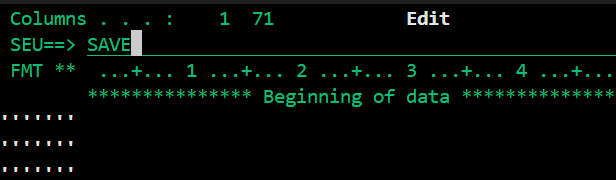
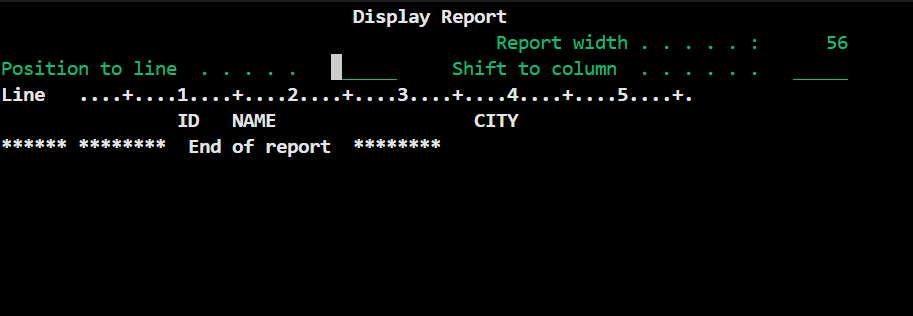

# 3.2 Physical File Aanmaken

## Source Physical File

Zoals ook met de RPGLE en display files zet je alle physical files in een aparte source physical file. Deze noemen we 'QDDSSRC'.

Dus:

1. Command `CRTSRCPF` (Create Source Physical File)

2. File naam 'QDDSSRC'

3. Bij Library jouw library name

4. Text description is optioneel

## Werken met SQL

Er zijn meerdere manieren om je physical file aan te maken. Degene die ik het fijnst vind is door gebruik te maken van een SQL statement.

### Maak SQL member aan

In je QDDSSRC source file - te vinden met command `WRKMBRPDM LIBRARY/QDDSSRC` - druk je op F6 om een nieuwe member aan te maken.

- Noem deze USRINF_SQL
- Source type is SQL
- Description optioneel

Na het aanmaken kom je in de text editor, typ achter SEU==> 'SAVE' en vervolgens op enter. Nu kun je uit dit scherm gaan met F3. Bij het exit scherm druk je nogmaals op enter. Als het goed is vindt je dan je nieuwe SQL member in je QDDSSRC.



### SQL in Visual Studio

Open je PFCITYNAME.SQL bestand nu in Visual Studio door het terug te vinden in je object browser. Hier kun je met SQL code een tabel aanmaken. Wij willen 3 kolommen: ID (=primary key), Naam en Woonplaats. Met onderstaande SQL statement gaan we een onze physical file maken.

```
CREATE TABLE LIBRARY/USRINF_PF (
    ID      INT GENERATED ALWAYS AS IDENTITY PRIMARY KEY,
    NAME    CHAR(20) NOT NULL,
    CITY    CHAR(20) NOT NULL
);
```

Sla dit bestand nu op en ga naar je terminal.

### SQL statement runnen

Als command voer je nu in: `RUNSQLSTM SRCFILE(LIBRARY/QDDSSRC) SRCMBR(USRINF_SQL)`

Hiermee zeg je dat je USRINF_PF als SQL statement wilt runnen. In dit geval maakt onze SQL statement een nieuwe tabel.

Als je geen error krijgt, zul je het gecompileerde bestand 'USRINF_PF' nu terugvinden in je library. Check dit met `WRKOBJPDM LIBRARY`.

Om de tabel weer te geven, gebruik je de command `RUNQRY *N LIBRARY/USRINF_PF`.



Je zult zien dat de kolommen correct zijn aangemaakt, en dat er nu nog geen data in staat. In het volgende hoofdstuk gaan we met onze RPGLE code ervoor zorgen dat we via onze display file van het vorig hoofdstuk data kunnen toevoegen aan onze tabel.

