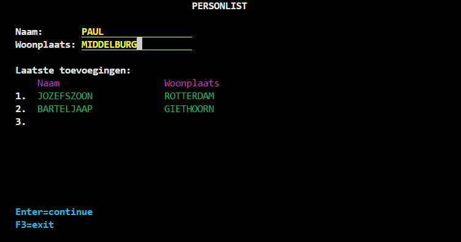
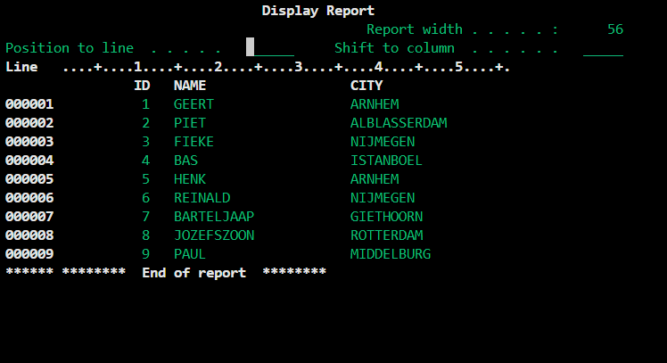

# 3.3 Data Invoegen met Programma

## Aanpassen RPGLE code

We gaan verder met de code die we in 2.4 hebben gemaakt. Daarvoor moet je ook eerst de display file gemaakt hebben in 2.2.

Heel veel hoeven we gelukkig niet aan te passen in de code. Het enige wat je hoeft toe te voegen zijn deze regels bovenin de `if not invalidInput` statement die je als het goed is al hebt.

```
    if not invalidInput;
        // Nieuwe gegevens opslaan in de database
        exec sql
            INSERT INTO USRINF_PF (NAME, CITY)
            VALUES (:nameIn, :cityIn);

    // Hieronder rest van de if-statement
```

Als je deze regels hebt toegevoegd sla je dit bestand op en open je terminal.

## RPGLE met SQL compileren

We kunnen het programma nu niet meer standaard compileren zoals we gedaan hebben vanaf [1.2 Hello World](../start/HelloWorld#compileren). Dit komt omdat we nu gebruik maken van SQL statements in onze RPGLE code.

Met onderstaande command compileer je het programma als SQL-RPGLE programma:

`CRTSQLRPGI OBJ(LIBRARY/PL_CODE) SRCFILE(LIBRARY/QRPGLESRC) COMMIT(*NONE)`

*Vergeet niet je eigen librarynaam in te vullen*

Als je een foutmelding krijgt, is er iets mis met de code. 

## Testen

Nu kun je de command `CALL LIBRARY/PL_CODE` uitvoeren om je programma te runnen.

Je display wordt zichtbaar en kan weer bij elke naam een woonplaats invullen. Het programma lijkt nog exact hetzelfde te werken als bij 2.4. Maar op de achtergrond gebeurt er wel degelijk iets.



Voer wat data in en daarna kun je het programma afsluiten met F3.

Nu willen we checken of de data correct is doorgevoerd naar onze USRINF_PF tabel.

Met de command `RUNQRY *N LIBRARY/USRINF_PF` bekijk je de tabel. Je zal zien dat alle ingevulde data hier nu staat opgeslagen! 



In het volgende deel gaan we de tabel uitlezen en weergeven in het programma zelf.